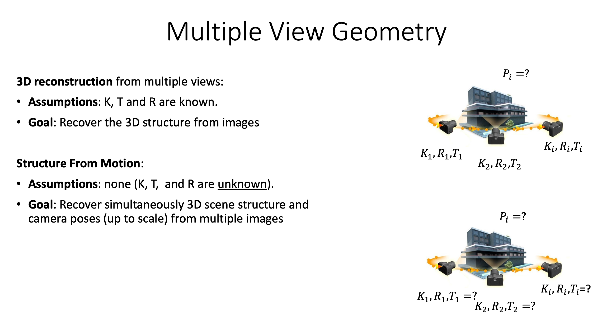
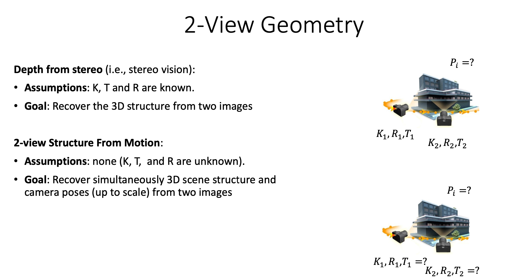

# Multiple View Geometry

- Epipolar constraint applies to both

## Structure from motion

- K known: calibrated SFM (use essential matrix E)
- k unknown: uncalibrated SFM (use fundamental matrix F)

